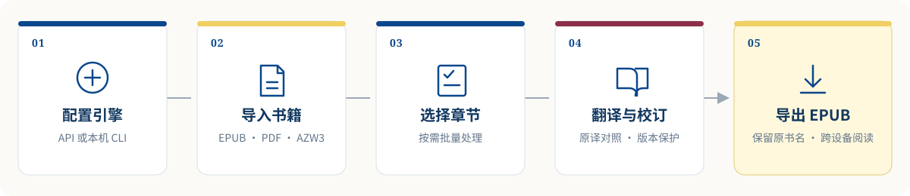
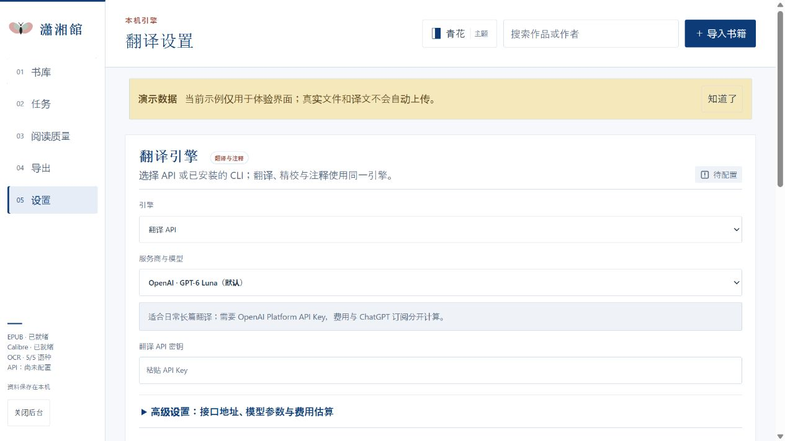
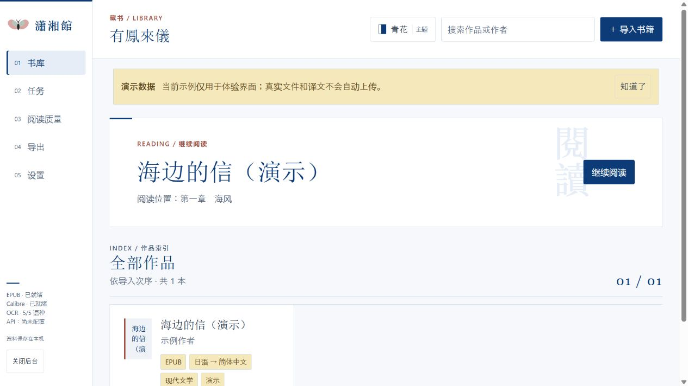
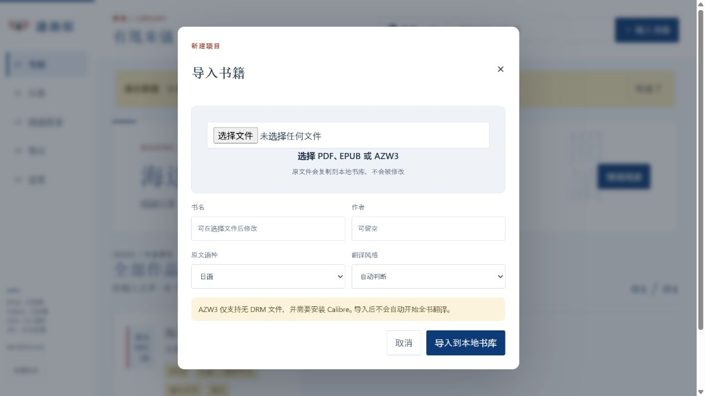
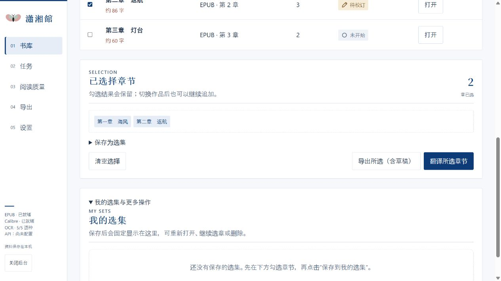
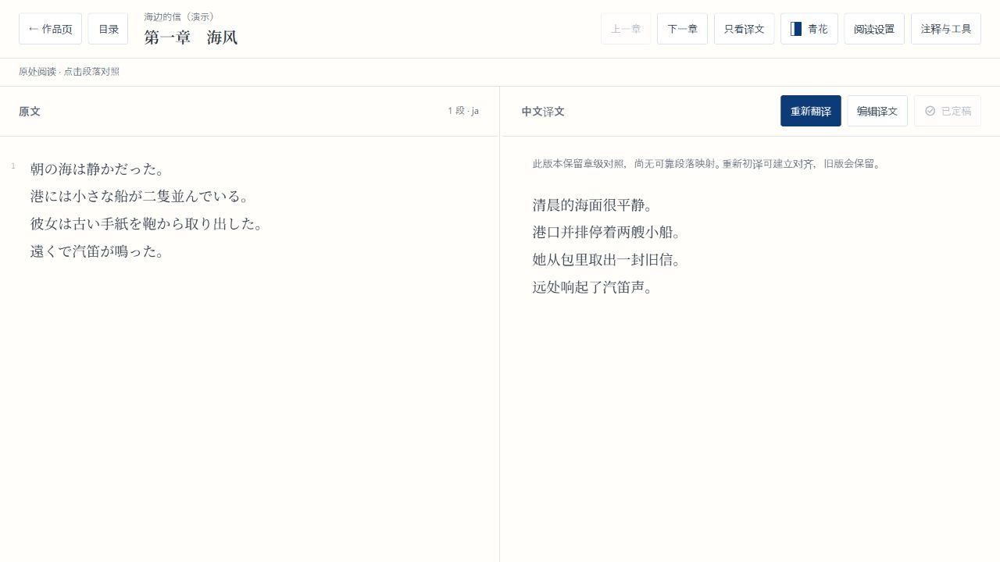

# 瀟湘館图解操作教程

[返回项目首页](../README.md)

本教程用虚构书籍“海边的信（演示）”说明从导入到导出 EPUB 的完整流程。截图不含真实作品、个人数据或 API 密钥。书籍、译文和设置默认保存在本机；只有翻译请求会发送到你在设置中选择的模型服务。



## 开始之前

需要 Node.js 20 或更新版本，以及 Python 3。在项目目录安装依赖并启动：

```sh
python -m pip install -r requirements.txt
npm start
```

Windows 也可以双击 `start-library.cmd`。浏览器打开 `http://127.0.0.1:4327/` 后即可进入书库。

## 第一步：配置翻译引擎

打开左侧 **05 设置**，进入“翻译引擎”。

1. 选择 **翻译 API** 或已安装的 CLI。
2. 选择服务商和模型；自定义兼容接口时填写 API 基础地址与模型名称。
3. 使用 API 时粘贴自己的密钥，然后点击“保存引擎配置”或“测试并保存”。测试会实际调用模型，可能产生费用。
4. Brave Search 只用于联网查证，是可选配置，不影响普通翻译。



CLI 的安装、登录与模型读取方式见 [CLI 安装与接入指南](cli-setup.md)。

## 第二步：导入书籍

回到 **01 有鳳來儀**，点击页面右上角的 **＋ 导入书籍**。



选择本机文件后设置原文语言和翻译配置，再点击导入。支持无 DRM 的 EPUB、PDF 和 AZW3：

- 文本型 PDF 可以直接提取；扫描 PDF 需要 Tesseract OCR 与对应语言模型。
- AZW3 需要安装 Calibre 的 `ebook-convert`，且文件不能带 DRM。
- 导入和解析都在本机进行。



## 第三步：选择并翻译章节

打开作品后，先确认章节已经正确提取。勾选需要处理的章节，然后点击 **翻译所选章节**。任务页面会持续显示进度，并支持暂停、取消和失败后继续。



翻译按块保存。关闭页面或重启服务后，已经完成的块仍会保留；再次进入章节可从未完成位置继续。分块、重试和段落 JSON 校验规则见 [翻译流程说明](translation-pipeline.md)。

## 第四步：阅读与校订

桌面阅读页默认左侧显示原文、右侧显示译文。点击对应段落会同步高亮；可使用 **重新翻译**、**编辑译文** 和 **标记定稿** 完成校订。



“注释与工具”中还提供目录、书内搜索、节选翻译、精校和版本历史。人工修改、定稿及已导出版本会受到保护，新生成的译稿保留在历史中供选择。

## 第五步：导出 EPUB

可以从作品页快速导出，也可以在章节选择区点击 **导出所选（含草稿）**：

- 只需要定稿内容时，选择正式导出。
- 需要边译边读时，可导出包含草稿的可阅读版本。
- 下载文件名使用唯一的 ASCII 兼容名称，便于 iPhone/iPad 从“文件”App 分享到 Apple“图书”。EPUB 内部书名和“图书”中显示的书名仍是原作品名。

导出完成后，在 iPhone 或 iPad 的“文件”App 中长按 EPUB，选择 **共享 → 图书**。

## 常见问题

### 提示“模型未返回有效的段落 JSON”

工作台会自动尝试修复和重试，并保留已经完成的块。若同一位置反复失败，请检查 API 地址、模型名称、密钥与输出 Token 上限，再从未完成块继续。也可以适当调小“每块原文目标字符数”。

### 扫描 PDF 没有正文

在“设置”中检查 Tesseract、Poppler 和对应语言模型是否就绪。日语竖排建议安装 `jpn_vert`。

### Apple“图书”没有导入反应

请使用当前版本重新导出，并保留工作台生成的 `xiaoxiangguan-...epub` 下载文件名。这个文件名用于规避 iOS/iPadOS 对部分非 ASCII 下载文件名的兼容问题，导入后的显示书名不会改变。

### 数据保存在哪里

打开“设置 → 本机数据与迁移”可查看实际目录。迁移时先停止程序，再复制整个数据目录。不要把数据目录、书籍或密钥提交到公开仓库。
